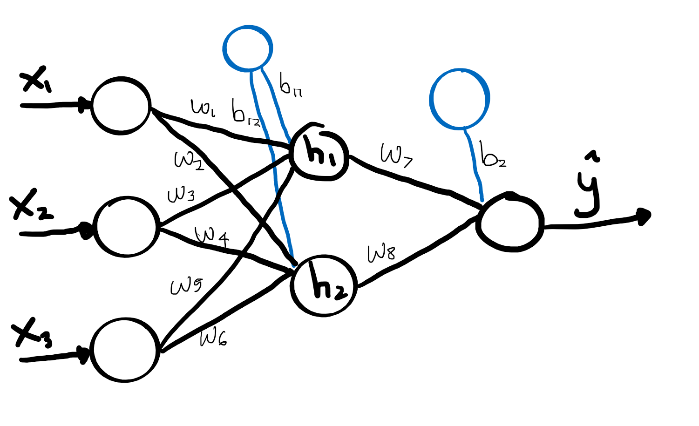
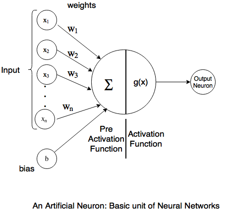

```{r setup, include=FALSE}
knitr::opts_chunk$set(echo = TRUE)
library(neuralnet)
library(ggplot2)
library(dplyr)
library(purrr)
library(caret)
```

# Disclaimer

The original content for Neural Network and Deep Learning course is produced and developed at Algoritma and is used as the main reference for [Algoritma Academy](http://algorit.ma/).

## Objective

By the end of this material, readers are expected to familiarize themselves with common deep learning hyperparameters and how to start tuning a deep learning model. There are 3 main topics in this material:

- Neurons and Activation Functions  
- Back Propagation and Partial Derivative  
- Neural network hyper parameters  

## Requirements

The framework I will be using in this exercise is `keras` in R. Based on the framework you are using, you will encounter some different syntax but the concepts will most likely to be implementable in mainstream frameworks (tensorflow, pytorch, etc.) as long as you know where to look.

# Neural Network Architecture

Take a look at the following architecture:



A neural network architecture, can be defined as mathematical notation as follow:

Given predictors:
$p:\{x_1, x_2, x_3\}$

And weights:

$w: \{w_1, w_2, w_3, w_4, w_5, w_6, w_7, w_8\}$  
$b: \{b_{11}, b_{12}, b_2\}$  

The hidden layer will be:

$h: \{ h_1, h_2\}$

Where:

$h_{1in} = x_1w_1 + x_2w_3 + x_3w5 + \beta_{11}$  
$h_{1out} = g(h_{1in})$  


$h_{2in} = x_1w_2 + x_2w_4 +x_3w_6 + \beta_{12}$  
$h_{2out} = g(h_{2in})$  


$h_{3in} = h_{1out}w_7 + h_{2out}w_8 + \beta_{2}$  
$h_{3out} = \hat y = g(h_{3in})$  

Given $g$ is an activation function for each layers. The activation function will be discussed more comprehensively on following sections. To give an easier illustration, the $g$ is assumed to be a linear function so:

$x = g(y) = y$

This process of calculating $\hat y$ is commonly known as **Feed-forward**.

Notice how each architecture defined in your model will create a different mathematical model for our problem. The idea of neural network is that it will try to perform a "learning process" where the $w$ will be adjusted in every iteration.

**Imagine**: A newly initialized neural network with random assigned weights are a newborn baby with no idea of any social cue.

Next, let's take a look at the following neuralnetwork:

```{r}
set.seed(100)
scaled_mtcars <- scale(mtcars)
colnames <- names(mtcars)
fml <- paste(colnames[1], paste(colnames[-1], collapse = "+"), sep = "~")
  
set.seed(100)
nn <- neuralnet(as.formula(fml), scaled_mtcars, hidden = 4)

plot(nn, rep = "best")
```

**Discussion**: Can you imagine the $\hat mpg$ of this model?

Do note that the $w$ in the plot is not the initialized weight, instead it's the weight that has been adjusted. Let's compare the 2:

```{r}
nn$startweights[[1]]
```

```{r}
nn$weights[[1]]
```

So what is the difference between the 2? For simpler terms: the random initialized weights does not consider wether or not their weights is a good number to predict $\hat{mpg}$, while the end weights is tuned to get the **smallest error possible**.

**Imagine:** A matured person that has understand *most* social cues and know how to act accordingly

So how small is smallest error possible?

```{r}
nn$result.matrix[1,1]
```

The error above is calculated using **half sum squared error**:

$E = \frac{1}{2} \Sigma(y - \hat y)^2$

Now to prove it let's use `compute()` to *predict* our $mpg$ on the `train` dataset or to perform the **feed-forward** process on the final weight:

```{r}
mpg_hat <- neuralnet::compute(nn, scaled_mtcars[,-1])

sum((scaled_mtcars[,1] - mpg_hat$net.result)^2)/2
```

## Terms Review: Discussion

Create your own definition of each terms!

1. Feed-forward
2. Random initialized weight
3. Final adjusted weight
4. Half sum squared error

# Learning Process

In this section we will answer how did the start weights adjusted into the final weight on neural network. This will be identified as neural network's **learning process**, which basically is not new concept in machine learning. For example:

1. Naive bayes: uses prior probability and likelihood as learning process
2. K-NN: uses data point distance as learning process
3. OLS linear regression: uses covariance of predictors and targets as learning process
4. Decision tree: uses information gain for splitting as learning process

Neural network, however uses a step by step learning process to adjust the weight. Recall on the previous plot we can see the **steps**, which indicates how many weight adjustment has be done to acquire the final weights.

```{r}
plot(nn, rep = "best")
```

```{r}
nn$result.matrix[3,1]
```

**Imagine:** Humans take some time to learn something new. Some teens might not be as matured as most adults and might need some trial and error mistakes to understand social cues they have not yet understood in the moment.

So the 567 steps is considered to be the most matured neural network can be made from the current architecture, dataset, and parameters. And at what basis? The model adjusted to the least **Error**, in our previous case was **half of sum squared error**.

So what exactly is it doing per step?

## Introduction to Partial Derivative

First, we'll go through some illustration of the following line to review on *gradient*:

```{r}
x <- seq(-3, 3, length.out = 1000)
y <- 2*x
lin <- data.frame(x,y)

dat.points <- data.frame(
  x = c(-2, -2+1, 1, 1+1),
  color = c("tomato3", "tomato3", "darkblue", "darkblue"),
  stringsAsFactors = F
) %>% 
  mutate(
    y = 2*x
  )

ggplot(lin, aes(x=x, y=y)) + 
  geom_line() +
  geom_point(data = dat.points, aes(color=color), size = 3) +
  geom_line(data = dat.points, aes(color=color, group=color), lty="dashed", size=1.5) +
  theme_minimal() +
  scale_color_manual(values=c("darkblue", "tomato3"))
```

Now see if we would like to calculate the gradient between 2 points, the `tomato3` line for each range of different $x$ example will be like the following:

$m = \frac{y_2 - y_1}{\Delta x}$, where $\Delta x = 1$ for both lines.

This, can also be defined as follow:

since $y = f(x) = 2x$, then

$m = \frac{f(x_1 + \Delta x) - f(x_1)}{\Delta x}$  

$m = \frac{2(x_1 + \Delta x) - 2(x_1)}{\Delta x}$  

$m = \frac{2 \Delta x}{\Delta x} = 2$, means across all $x$, the gradient between the points of $x_1, x_2$ where $x_2 - x_1 = \Delta x$ will have the same gradient of 2.

Now consider this:

```{r}
x <- seq(-3, 3, length.out = 1000)
y <- x^2
quad <- data.frame(x, y)

dat.points <- data.frame(
  x = c(-2, -2+1, 1, 1+1),
  color = c("tomato3", "tomato3", "darkblue", "darkblue"),
  stringsAsFactors = F
) %>% 
  mutate(
    y = x^2
  )

ggplot(quad, aes(x=x, y=y)) + 
  geom_line() +
  geom_point(data = dat.points, aes(color=color), size = 3) +
  geom_line(data = dat.points, aes(color=color, group=color), lty="dashed", size=1.5) +
  theme_minimal() +
  scale_color_manual(values=c("darkblue", "tomato3"))
  
```

The 2 points, have the same $\Delta x$ of 1, but calculating gradient in a value of $x$ will have different gradient result. From here, it will be useful to use the limit definition of a derivative stated as follow:

$\frac{\partial f(x)}{\partial x} = \lim_{h \to 0} \frac{f(x + h) - f(x)}{h}$  

In a lament terms, this can be reffered as: calculating the gradient of a tangent point of each $x$ in a curve.

Means if we were to use the derivative function:

$y = f(x) = x^2$  

$\frac{\partial y}{\partial x} = f'(x) = 2x$  

So, we got the following:

$f'(-2) = -4$  
$f'(-1) = -2$  
$f'(1) = 2$  
$f'(2) = 4$  

Which each tells us the gradient of the tangent points for each x:

```{r}
x <- seq(-3, 3, length.out = 1000)
y <- x^2
quad <- data.frame(x, y)

spl <- smooth.spline(y ~ x)
pred0 <- predict(spl, x=c(-2,-1,1,2), deriv=0)
pred1 <- predict(spl, x=c(-2,-1,1,2), deriv=1)

t <- data.frame(
  x = c(-2, -1, 1, 2),
  color = c("tomato3", "tomato3", "darkblue", "darkblue"),
  stringsAsFactors = F
) %>% 
  mutate(
    y = x^2,
    m = 2*x,
    yint = pred0$y - (pred1$y*x),
  )

ggplot(quad, aes(x=x, y=y)) + 
  geom_line() +
  geom_point(data=t, size=3, aes(color=color)) +
  geom_abline(data = t, aes(slope = m, intercept = yint, color=color), size=1.1, lty="dashed") +
  theme_minimal() +
  scale_color_manual(values=c("darkblue", "tomato3"))
```

## Back-propagation

The idea of the previous exercise is esential in understanding the next concept. In this section we will go through a basic weight optimization algorithm for neural network, or commonly known as the **backpropagation process**. In later sections, we will dive deeper into a more sophisticated algorithm, but before we are going to start with the basic ones: **gradient descent**. This is a pretty straight forward idea:

```{r}
x <- seq(-3, 3, length.out = 1000)
y <- x^2
quad <- data.frame(x, y)

spl <- smooth.spline(y ~ x)
pred0 <- predict(spl, x=c(-1,1), deriv=0)
pred1 <- predict(spl, x=c(-1,1), deriv=1)

t <- data.frame(
  x = c(-1, 1),
  color = c("tomato3", "darkblue"),
  stringsAsFactors = F
) %>% 
  mutate(
    y = x^2,
    m = 2*x,
    yint = pred0$y - (pred1$y*x),
  )

ggplot(quad, aes(x=x, y=y)) + 
  geom_line() +
  geom_point(data=t, size=3, aes(color=color)) +
  geom_abline(data = t, aes(slope = m, intercept = yint, color=color), size=1.1, lty="dashed") +
  theme_minimal() +
  scale_color_manual(values=c("darkblue", "tomato3")) +
  labs(
    x = "weight",
    y = "Error"
  )
```

Now take a look at the red line, the slope of the left line is $m = -2$, while the slope of the right line is $m = 2$. What does it mean? Means a negative slope give us the idea in order to achieve **local minima** the weight need to be adjusted to the right, and if the slope is positive, the weight need to be adjusted to the left, hence is defined with the following formula:

$w_{adj} = w_{old} - \alpha \frac{\partial E}{\partial w}$

So there's a new notation: $\alpha$, or commonly known as **learning rate**. A steeper the gradient gives a stronger indication of having to adjust the weight. But we wouldn't want to use the gradient itself to adjust our weight but instead use $\alpha \frac{\partial E}{\partial w}$ instead, this would then update our weight slowly towards the local minima without having to worry if the adjusted weight was updated way past the local minima. This *mini learning* is then repeated several times until it past a certain threshold of gradient ($\approx 0$) and assumed that it has arrived at the local minima.

```{r}
x <- seq(-3, 3, length.out = 1000)
y <- x^2
quad <- data.frame(x, y)

spl <- smooth.spline(y ~ x)
pred0 <- predict(spl, x=c(0), deriv=0)
pred1 <- predict(spl, x=c(0), deriv=1)

t <- data.frame(
  x = c(0),
  color = c("darkgrey"),
  stringsAsFactors = F
) %>% 
  mutate(
    y = x^2,
    m = 2*x,
    yint = pred0$y - (pred1$y*x),
  )

ggplot(quad, aes(x=x, y=y)) + 
  geom_line() +
  geom_point(data=t, size=3, aes(color=color)) +
  geom_abline(data = t, aes(slope = m, intercept = yint, color=color), size=1.1, lty="dashed") +
  theme_minimal() +
  scale_color_manual(values=c("darkgrey")) +
  labs(
    x = "weight",
    y = "Error"
  )
```

The learning rate, range from 0 to 1, where the most important paremeter to tune in building a neural network model is most likely a learning rate. A higher learning rate means the bigger the adjustment each step, whilst the smaller one means smaller adjustement step:

**Big learning rate**  
- Tend to go pass local minima and model can be easier to coverge even before acquiring adequate error  
- Quicker to train  
**Small learning rate**  
- Tend to get stucked into a arbitrary local minima since it takes most of data noises  
- Requires a lot of steps before converging, slower to train  

So what you want: is somewhere in between where the common value for $\alpha$ could be 0.01, 0.001, 0.0001 going from larger to smaller value in sequence.

So recall that we have a set of weights and biases to adjust for:


$w: \{w_1, w_2, w_3, w_4, w_5, w_6, w_7, w_8\}$  
$b: \{\beta_{11}, \beta_{12}, \beta_2\}$  

So how does it work? The same error function will be then used for multiple weight adjustment and in this exact for all 11 of the weights and biases. The idea to solve this is by using a chaining rule for partial derivative.

Since,

$h_{1in} = x_1w_1 + x_2w_3 + x_3w5 + \beta_{11}$  
$h_{1out} = g(h_{1in})$  

$h_{2in} = x_1w_2 + x_2w_4 +x_3w_6 + \beta_{12}$  
$h_{2out} = g(h_{2in})$  

$h_{3in} = h_{1out}w_7 + h_{2out}w_8 + \beta_{2}$  
$h_{3out} = g(h_{3in})$  

Means if we were to use partial derivation of $E$ to update $w_1$, we would have the following:

$\frac{\partial E}{\partial w_1}$  

which if we recall the $E$ is defined as following:

$E = \frac{1}{2} \Sigma(y - \hat y)^2$  

and our $\hat y$ is actually defined with the following:

$\hat y = h_{3out}$

and $h_{3out}$ is affected by $h_{1out}, h_{2out}, h_{3out}$ and so forth until it reaches our $w_1$. In mathematical notation, we can use the chaining rule and defined as follow for the problem:

$\frac{\partial E}{\partial w_1} = \frac{\partial E}{ \partial \hat{y}} . \frac{\partial \hat{y}}{\partial h_{1out}}.\frac{\partial h_{1out}}{\partial h_{1in}}.\frac{\partial h_{1in}}{\partial w_1}$

or 

$\frac{\partial E}{\partial w_2} = \frac{\partial E}{ \partial \hat{y}} . \frac{\partial \hat{y}}{\partial h_{1out}}.\frac{\partial h_{1out}}{\partial h_{1in}}.\frac{\partial h_{1in}}{\partial w_2}$

and same with all of the existing weights, you get the idea.

So going back to our **steps**:

```{r}
nn$result.matrix[3,1]
```

This means the model went through 567 of weight adjustement until it reaches the threshold and stopped.

## Terms Review: Discussion

Create your own definition of each terms!

1. Back-propagation
2. Learning Rate
3. Gradient Descent
4. Model Steps

# Machine Learning Problem on Neural Network

So by now you should be able to identify machine learning problem, specifically on supervised learning:

- Regression, modelling $y$ based on a set of predictors $\{x_1, x_2, ..., x_n\}$  
- Classification, modeling probability of event occurence, commonly divided into:
  - Binary classification: Predicting the probability of an event happen (vs not happening)  
  - Multiclass classification: Predicting the probability of a set of events $\{E_1, E_2, E_3, ..., E_n \}$  
- Time series, modelling $y_t$ based on a set of lags of y $\{y_{t-1}, y_{t-2}, y_{t-3},..., y_{t-n}\}$

Neural network, basically support the machine learning problems stated above. It's a matter of how do we design the architecture that suited to the problem framing. To do that first we need to understand **activation function** on neuron. Each neuron, is equipped with what we call as activation function and serves as value transformer for every feeded value ($h_{in}$).



Activation function, is in fact have a really important roles for neural network. When applied, the mathematical model is no longer bound to linearity assumption which in most data might not be the case. Compare this:

```{r}
lm(as.formula(fml), scaled_mtcars %>% as.data.frame())$coefficients
```

```{r}
neuralnet(as.formula(fml), scaled_mtcars, hidden = 0) %>% 
  plot(rep = "best")
```

What do you think is the different between the 2? If you look closely, both are creating *a similar* value of coefficients in order to acquire the best model possible. The only difference is that OLS uses covariance of each predicotrs to *mpg* to calculate the $\beta$ while neural network use the backpropagation process to acquire the weights and bias. However in mathematical notation both have the same exact form.

$\hat{mpg} = \beta_1cyl + \beta_2disp + \beta_3hp + \beta_4drat + \beta_5wt + \beta_6qsec + \beta_7vs + \beta_8am + \beta_9gear + \beta_{10} carb + \beta_0$

so what does it really means? Recall that in using linear regression comes multiple limitations and assumptions. These does not support a non-linear relationship between target and predictors. However, when using a hidden layer along with its activation function, you are able to introduce the possibility of having to model $mpg$ in a non-linear model with each of the predictors.

There are some common activation functions that can be used, for example:


In our previous exercise, the `neuralnet()` function is by default using a sigmoid function to transform our value in the hidden layer. The sigmoid function, if you recall will transform any number into the range of $[0..1]$:

```{r}
x <- seq(-3,3, length.out = 1000)
sigmoid <- function(x) {
   1 / (1 + exp(-x))
}
plot(x, sigmoid(x), type = "l")
```

So really when you model the $mpg$ using a hidden layer with activation function, you will get the following:

```{r}
plot(nn, rep = "best")
```

where,

$h_{1in} = \beta_1cyl + \beta_2disp + \beta_3hp + \beta_4drat + \beta_5wt + \beta_6qsec + \beta_7vs + \beta_8am + \beta_9gear + \beta_{10} carb + \beta_0$
$h_{1out} = sigmoid(h_{1in})$

and so on for the other neuron on the hidden layer. For other activation functions implementation we'll take a look when we use the `keras` framework for quick model prototyping.

Next, the activation function, in fact, is not used to only input layers. The output layers, can also be embed with an activation function. However, choosing which activation function can be used on output layer depends on the machine learning problem we're trying to solve. The hint is, on the previous exercise, modelling `mpg` you are expected to have the $\hat{mpg}$ to range between $[-\inf, \inf]$, means we are defining a regression problem. In binary classification however, we need to predict the $\hat y$ as a probability, which ranges from $[0,1]$. So, the most logical way to adjust is to use the same sigmoid activation function on the output neuron. Let's take a look at the following example of modelling `iris` dataset into determining Species of "Virginica or not".

```{r}
iris$Species <- ifelse(iris$Species == "virginica", "virginica", "Not virginica")
table(iris$Species)
```

Next, the neural network uses a set of matrix operation to perform feed forward, hence all input and ground truth need to be stored as a numeric. In this case, we shall use the first 4 columns (flower shape), and a flag of virginica or not as the label.

```{r}
iris$y <- ifelse(iris$Species == "virginica", 1, 0)
table(iris$y)
```

Then we have the following:

```{r}
x <- iris[,1:4] %>% scale()
y <- iris$y

dat <- cbind(x, y)
columns <- colnames(dat)

fml <- paste(columns[5], paste(columns[-5], collapse = "+"), sep = "~")

set.seed(100)
nn_iris <- neuralnet(as.formula(fml), dat, hidden = 2, linear.output = F)
plot(nn_iris, rep = "best")
```

Now let's take a look at the main different between having a linear output and non linear output (in this case, activated through sigmoid function):

```{r}
pred <- neuralnet::compute(nn_iris, dat[,-5])$net.result
dat <- cbind(dat, round(pred, 5))
summary(dat[,6])
```

Notice that none of the $\hat y$ will be predicted with value bigger than 1 or less than 0, this will then serve as the prediction probability to model wether or not a certain observation is a `virginica` while using a non linear model for 4 different predictors.

However, there are one more adjustment that is common to do. Recall how we use the **half sum squared error** on the previous `mpg` problem. In classification problem, the common Error function, or commonly referred as **cost function** is a cross-entropy. The following is the formula for cross entropy:

$E = - \sum(ylog(\hat y) + (1-y)log(1-\hat y))$ 

If we were to take an extreme missclassification:
$y = 0$ and $\hat y = 1$  
Then:

$E = - (0log(1) + (1-0)log(1-1)) = -(0 + (1 \times-\inf)) = \inf$

And an extreme case of correct classification:
$y = 0$ and $\hat y = 0$  
Then:

$E = - (0log(0) + (1-0)log(1-0)) = 0$

So a bit adjustment on the model is to let the backpropagation optimize on cross-entropy function rather than sum of squared error:

```{r}
set.seed(100)
nn_iris <- neuralnet(as.formula(fml), dat, hidden = 2, linear.output = F, err.fct = "ce")
plot(nn_iris, rep = "best")
```

Notice how the error is significantly smaller than optimizing using an SSE cost function.

Now the binary classification and regression has been discussed. We'll move along to multiclass classification and time series. This however, will not be discussed with much details, for the implementation itself is much more intuitive. For multiclass classification, you will required to prepare an $n$ column of $y$ matrix, each representing a flag for each class. So for example in our `iris` dataset, we would like to have something like this:

```{r}
data(iris)
dmy <- dummyVars( ~ ., data = iris)
iris <- predict(dmy, newdata= iris)
head(iris[,5:7])
tail(iris[,5:7])
```

Next is to prepare the activation function. A multiclass classification function does not use a sigmoid function as activation. Instead, it use a softmax function illustrated as follow:

```{r}
x <- seq(-3, 3, length.out = 1000)
softmax <- function(x){
  return(exp(x)/sum(exp(x)))
}
plot(x, softmax(x), type = "l")
```

The main difference between softmax and sigmoid is that while sigmoid limits the range to $[0, 1]$, softmax did not limit the maximum value of $y$. This is the idea being reflected in multiclass classification where multiple classess probability must add up to 1. This constraint are being used by sotfmax to phrase the problem on multiclass classification.

Last is the time series problem. While all 3 previous problems can be imagined quite well with the current architecture we have learned, neural network, in fact, has countless number of possible neural network architecture, and a feed-forward neural network is only one of them. The other popular architecture is a **recurrent neural network**, where the main difference is the direction of neuron signal:


A very popular layer architecture for reccurent neural network is called **long short term memory**, which we'll visit in the next chapter. But the idea is that by using only one vector of predictor, but having the signal rerouted into the same neuron will give the capability of the neuron to calculate its next data using the information of the previous one, a common time series approach for forecasting.

## Terms Review: Discussion

Create your own definition of each terms!

1. Activation function
2. Cost function
3. Dummy variables
4. Recurrent Neural Network

# Framework implementation: `keras`

To keep the notebook light, the `keras` section will be created under different rmd file. Please open `keras.Rmd` for the next section.